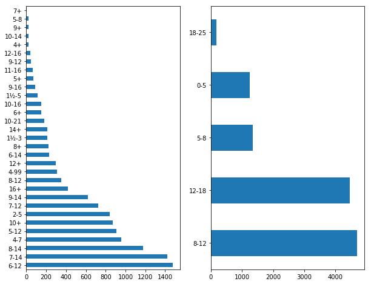

```python
import pandas as pd
```


```python
df = pd.read_csv('lego_sets.csv')
df.head()
```


<div>
<style>
    .dataframe thead tr:only-child th {
        text-align: right;
    }

    .dataframe thead th {
        text-align: left;
    }

    .dataframe tbody tr th {
        vertical-align: top;
    }
</style>
<table border="1" class="dataframe">
  <thead>
    <tr style="text-align: right;">
      <th></th>
      <th>ages</th>
      <th>list_price</th>
      <th>num_reviews</th>
      <th>piece_count</th>
      <th>play_star_rating</th>
      <th>prod_desc</th>
      <th>prod_id</th>
      <th>prod_long_desc</th>
      <th>review_difficulty</th>
      <th>set_name</th>
      <th>star_rating</th>
      <th>theme_name</th>
      <th>val_star_rating</th>
      <th>country</th>
    </tr>
  </thead>
  <tbody>
    <tr>
      <th>0</th>
      <td>6-12</td>
      <td>29.99</td>
      <td>2.0</td>
      <td>277.0</td>
      <td>4.0</td>
      <td>Catapult into action and take back the eggs fr...</td>
      <td>75823.0</td>
      <td>Use the staircase catapult to launch Red into ...</td>
      <td>Average</td>
      <td>Bird Island Egg Heist</td>
      <td>4.5</td>
      <td>Angry Birds™</td>
      <td>4.0</td>
      <td>US</td>
    </tr>
    <tr>
      <th>1</th>
      <td>6-12</td>
      <td>19.99</td>
      <td>2.0</td>
      <td>168.0</td>
      <td>4.0</td>
      <td>Launch a flying attack and rescue the eggs fro...</td>
      <td>75822.0</td>
      <td>Pilot Pig has taken off from Bird Island with ...</td>
      <td>Easy</td>
      <td>Piggy Plane Attack</td>
      <td>5.0</td>
      <td>Angry Birds™</td>
      <td>4.0</td>
      <td>US</td>
    </tr>
    <tr>
      <th>2</th>
      <td>6-12</td>
      <td>12.99</td>
      <td>11.0</td>
      <td>74.0</td>
      <td>4.3</td>
      <td>Chase the piggy with lightning-fast Chuck and ...</td>
      <td>75821.0</td>
      <td>Pitch speedy bird Chuck against the Piggy Car....</td>
      <td>Easy</td>
      <td>Piggy Car Escape</td>
      <td>4.3</td>
      <td>Angry Birds™</td>
      <td>4.1</td>
      <td>US</td>
    </tr>
    <tr>
      <th>3</th>
      <td>12+</td>
      <td>99.99</td>
      <td>23.0</td>
      <td>1032.0</td>
      <td>3.6</td>
      <td>Explore the architecture of the United States ...</td>
      <td>21030.0</td>
      <td>Discover the architectural secrets of the icon...</td>
      <td>Average</td>
      <td>United States Capitol Building</td>
      <td>4.6</td>
      <td>Architecture</td>
      <td>4.3</td>
      <td>US</td>
    </tr>
    <tr>
      <th>4</th>
      <td>12+</td>
      <td>79.99</td>
      <td>14.0</td>
      <td>744.0</td>
      <td>3.2</td>
      <td>Recreate the Solomon R. Guggenheim Museum® wit...</td>
      <td>21035.0</td>
      <td>Discover the architectural secrets of Frank Ll...</td>
      <td>Challenging</td>
      <td>Solomon R. Guggenheim Museum®</td>
      <td>4.6</td>
      <td>Architecture</td>
      <td>4.1</td>
      <td>US</td>
    </tr>
  </tbody>
</table>
</div>


# Standard Normal Variables

A standard practice when normalizing data in preprocessing for analysis is to often rescale variable to be standard normal variables. Standard normal variables have a mean of zero and a standard deviation of 1. You can transform any variable X into a standard normal variable Z as follows:

$Z = \frac{x-\mu}{\sigma}$

Where $\mu$ is the mean of X and $\sigma$ is the standard deviation of x.

Normalize all of the numeric columns in the dataframe using this transformation.


```python
import numpy as np
```


```python
df.info()
```

    <class 'pandas.core.frame.DataFrame'>
    RangeIndex: 12261 entries, 0 to 12260
    Data columns (total 14 columns):
    ages                 12261 non-null object
    list_price           12261 non-null float64
    num_reviews          10641 non-null float64
    piece_count          12261 non-null float64
    play_star_rating     10486 non-null float64
    prod_desc            11884 non-null object
    prod_id              12261 non-null float64
    prod_long_desc       12261 non-null object
    review_difficulty    10206 non-null object
    set_name             12261 non-null object
    star_rating          10641 non-null float64
    theme_name           12258 non-null object
    val_star_rating      10466 non-null float64
    country              12261 non-null object
    dtypes: float64(7), object(7)
    memory usage: 1.3+ MB


```python
#Your code here
for col in df.columns:
    if df[col].dtype in [np.float64]:
        mu = df[col].mean()
        std = df[col].std()
        df[col] = df[col].map(lambda x: (x-mu)/std)
        print('Transformed {} to standard normal variable.')
        print('Original mu: {} std: {}, Now mu: {} std: {}'.format(mu, std, df[col].mean(), df[col].std()))
    else:
        continue
```

    Transformed {} to standard normal variable.
    Original mu: 65.14199840958968 std: 91.9804293059252, Now mu: 1.8110154288224448e-14 std: 0.9999999999999973
    Transformed {} to standard normal variable.
    Original mu: 16.82623813551358 std: 36.36898377283125, Now mu: -2.4377225691997434e-16 std: 1.0000000000000222
    Transformed {} to standard normal variable.
    Original mu: 493.40592121360413 std: 825.364580411521, Now mu: -3.306401903938308e-17 std: 1.0000000000000073
    Transformed {} to standard normal variable.
    Original mu: 4.337640663742107 std: 0.6520510342493655, Now mu: 3.89770812527246e-14 std: 1.0000000000000264
    Transformed {} to standard normal variable.
    Original mu: 59836.7523040535 std: 163811.4523357176, Now mu: -2.5472605384133787e-17 std: 0.9999999999999981
    Transformed {} to standard normal variable.
    Original mu: 4.514134009961459 std: 0.5188653617448391, Now mu: 2.153038682506626e-14 std: 0.9999999999999868
    Transformed {} to standard normal variable.
    Original mu: 4.22896044334037 std: 0.660282127774452, Now mu: -4.4576886505471716e-14 std: 0.9999999999999545


# Data Transformation

Create a dictionary that rebins the age column to the following age ranges:
Under 5, 5-8, 8-12, 12-18, 18-25, 25-35, 35-55, 55-64, 65+ 

*If there is a conflict in age bin, default to the higher age bin.


```python
len(bins)
```


    9


```python
#Preview Current Values
df.ages.value_counts()[:5]
        
```


    6-12    1476
    7-14    1421
    8-14    1180
    4-7      957
    5-12     911
    Name: ages, dtype: int64


```python
bins = ['0-5', '5-8', '8-12', '12-18', '18-25', '25-35', '35-55', '55-64', '65+']
up_lims = [int(bin.split('-')[-1].strip('+')) for bin in bins]
bin_map = {}
for age in df.ages.unique():
    cur_up_lim = int(age.split('-')[-1].strip('+'))
#     cur_lwr_lim = age.split('-')[0]
    #Iterate through the list to find bin that age falls in
    for n, new_up_lim in enumerate(up_lims):
        if cur_up_lim <= new_up_lim:
#             print(cur_up_lim, new_up_lim)
            bin_map[age] = bins[n]
            break
```

# Notes
This transformation is messy and arguements could certainly be made for a few corrections below including the mapping of 5+ to the 0-5 bin range. Further conditional rules could be introduced to handle this case.


```python
#Preview Dict
bin_map
```


    {'10+': '8-12',
     '10-14': '12-18',
     '10-16': '12-18',
     '10-21': '18-25',
     '11-16': '12-18',
     '12+': '8-12',
     '12-16': '12-18',
     '14+': '12-18',
     '16+': '12-18',
     '1½-3': '0-5',
     '1½-5': '0-5',
     '2-5': '0-5',
     '4+': '0-5',
     '4-7': '5-8',
     '5+': '0-5',
     '5-12': '8-12',
     '5-8': '5-8',
     '6+': '5-8',
     '6-12': '8-12',
     '6-14': '12-18',
     '7+': '5-8',
     '7-12': '8-12',
     '7-14': '12-18',
     '8+': '5-8',
     '8-12': '8-12',
     '8-14': '12-18',
     '9+': '8-12',
     '9-12': '8-12',
     '9-14': '12-18',
     '9-16': '12-18'}


```python
df['ages2'] = df.ages.map(bin_map)
df['ages2'].value_counts()
```


    8-12     4695
    12-18    4459
    5-8      1354
    0-5      1258
    18-25     184
    Name: ages2, dtype: int64


# Data Visualization
Create a bar graph depicting the number of lego sets for the original age range column. Then create a second bar graph for the new age column you created. How do they compare?


```python
import matplotlib.pyplot as plt
import seaborn as sns
%matplotlib inline
```


```python
fig, (ax1, ax2) = plt.subplots(nrows=1, ncols=2, figsize=(10,8))
df.ages.value_counts().plot(ax=ax1, kind='barh')
df.ages2.value_counts().plot(ax=ax2, kind='barh')

```


    <matplotlib.axes._subplots.AxesSubplot at 0x20acc3df710>


```python
#With ordering
temp = df.ages.value_counts()
temp = temp.reset_index()
temp.columns = ['age_bracket', 'count']
temp['order'] = temp['age_bracket'].map(lambda x: int(x.split('-')[0].strip('+').strip('½')))
temp = temp.sort_values(by='order')
temp = temp.set_index('age_bracket')
temp['count'].plot(kind='barh')
```


    <matplotlib.axes._subplots.AxesSubplot at 0x20acc55e128>





```python
fig, (ax1, ax2) = plt.subplots(nrows=1, ncols=2, figsize=(10,8))

temp = df.ages.value_counts()
temp = temp.reset_index()
temp.columns = ['age_bracket', 'count']
temp['order'] = temp['age_bracket'].map(lambda x: int(x.split('-')[0].strip('+').strip('½')))
temp = temp.sort_values(by='order')
temp = temp.set_index('age_bracket')
temp['count'].plot(ax=ax1, kind='barh')

temp = df.ages2.value_counts()
temp = temp.reset_index()
temp.columns = ['age_bracket', 'count']
temp['order'] = temp['age_bracket'].map(lambda x: int(x.split('-')[0].strip('+').strip('½')))
temp = temp.sort_values(by='order')
temp = temp.set_index('age_bracket')
temp['count'].plot(ax=ax2, kind='barh')
```


    <matplotlib.axes._subplots.AxesSubplot at 0x20acc4caeb8>


# Level Up:
Write your dictionary for the data transformation with a loop rather then manually coding the mapping.


```python
# See code above.
```
